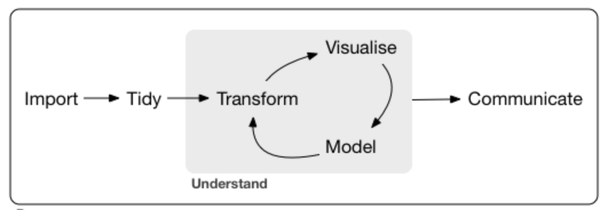

```{r setup, include=FALSE}
knitr::opts_chunk$set(echo = TRUE)
```

#Open Skill data science skills analysis

Use data in Open Skills web site to find job titles with Data Science skills.  
Data from site to be used is clean_title_count

Use tidy workflow to produce analysis:




##Libraries

```{r message=FALSE}
library(RCurl)
library(dplyr)
library(tidyr)
library(rvest)
library(stringr)
library(kableExtra)
```

##Import

###Get list of csv files to import from Open Skills website

```{r}
csvFiles<-read_html("https://open-skills-datasets.s3-us-west-2.amazonaws.com/") %>% html_nodes("key") %>% html_text() %>% str_extract("cleaned_title_count/[:print:]+") %>% str_extract("[0-9]+Q[1-4].csv")
csvFiles<-csvFiles[!is.na(csvFiles)] 
csvFiles %>% kable(align = 'c') %>% kable_styling() %>% scroll_box(width = "300px",height="400px") %>% kable_styling(position = "center") 
```

###Load last 4 csv files - last year worth of data

```{r}
out<-vector()
for (i in 0:3) {
  url<-paste("https://open-skills-datasets.s3-us-west-2.amazonaws.com/cleaned_title_count/",csvFiles[length(csvFiles)-i],sep="") 
  x<-getURL(url)
  out<-rbind(out,read.csv(textConnection(x)))
}
dataTable<-tbl_df(out)
head(dataTable,n=20) %>% kable() %>% kable_styling() %>% scroll_box(width = "910px",height="400px")
```

##Tidy

```{r}
#tidyDataTable<-gather(dataTable,)
```

